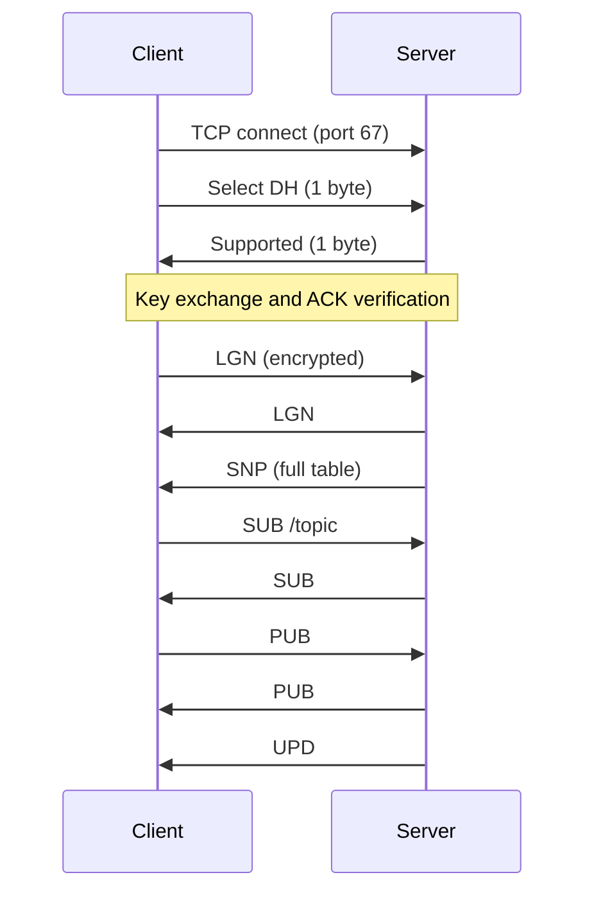

# SimpleNetworkTables — Communication Protocol Specification

**English version** · See also: [`פרוטוקול.md`](פרוטוקול.md) (Hebrew)

This document describes how the **host** (`host/Server.py`) and **client** (`client/src/backend.py`, `protocol/tcp_client.py`) communicate over TCP. SimpleNetworkTables is an educational clone inspired by WPILib NetworkTables; it is **not** wire-compatible with official NetworkTables 4.

---

## 1. Overview

Communication is layered:

| Layer | Description |
|-------|-------------|
| Transport | TCP (IPv4), port **67** |
| Framing | Length-prefixed messages (“TCP by size”) |
| Key exchange | RSA or Diffie-Hellman (plaintext during handshake) |
| Application | AES-256-CBC encrypted messages with 3-letter opcodes |

Main implementation files:

| File | Role |
|------|------|
| `protocol/tcp_socket.py` | Framing, AES encrypt/decrypt |
| `protocol/tcp_client.py` | Client handshake (RSA / DH) |
| `protocol/tcp_server.py` | `ClientSocketWrapper`, server handshake |
| `protocol/protocol_constants.py` | Opcodes (`ProtocolCode`), errors (`ProtocolError`) |
| `protocol/NetworkTables.py` | Hierarchical topic tree |
| `protocol/Entry.py` | Entry types, subscribers, update delivery |
| `host/Request.py` | Maps handler results to success or `ERR` responses |

---

## 2. Transport

- **Protocol:** TCP only (no HTTP, WebSocket, or UDP).
- **Server:** Binds to `0.0.0.0:67` (`host/server_constants.py`).
- **Client:** Connects to `127.0.0.1:67` by default (`client/src/BackendConstants.py`).
- **Sessions:** One persistent TCP connection per client. The server creates a dedicated thread group per accepted socket.

---

## 3. Message framing (TCP by size)

Before encryption is applied, every message uses the same framing (`protocol/tcp_socket.py`):

```
┌──────────────────┬─────────────────────────────┐
│ 8-byte header    │  payload (exactly N bytes)  │
│ (7 digits + '|') │                             │
└──────────────────┴─────────────────────────────┘
```

- **Header:** Seven zero-padded decimal digits plus `|` (e.g. `0000042|` for 42 bytes).
- **Functions:** `raw_send_with_size` / `raw_recv_by_size` — framing only.
- **Functions:** `send_with_size` / `recv_by_size` — framing plus AES (after handshake).

If the receiver does not read the full payload, the implementation returns empty bytes (`b""`), which should be treated as a connection failure.

---

## 4. Secure session establishment

The client selects **RSA** or **Diffie-Hellman** via `EncryptionType` in the UI. The server reads the choice in `ClientSocketWrapper.accept_secure()`.

### 4.1 Algorithm negotiation

| Direction | Content | Meaning |
|-----------|---------|---------|
| Client → Server | 1 byte: `encryption_type.value` | `1` = RSA, `2` = DH |
| Server → Client | 1 byte | `1` = supported, `0` = rejected |

### 4.2 RSA handshake

All steps use **raw** framing (no AES):

1. Client → Server: `ACK` (string `"ACK"`).
2. Server → Client: RSA public key (PEM).
3. Client → Server: 32-byte AES key encrypted with RSA-OAEP (SHA-256).
4. Server decrypts and stores `aes_key`.
5. Server → Client: encrypted `ACK` via `send_with_size`.
6. Client verifies decrypted `ACK` → session established.

The client generates the AES key at `TcpClient` construction (`os.urandom(32)`).

### 4.3 Diffie-Hellman handshake

1. Client → Server: `ACK` (raw).
2. Server → Client: DH parameters from `host/DH.pem` (2048-bit, auto-generated if missing).
3. Client → Server: client public key (PEM).
4. Server → Client: server public key (PEM).
5. Both sides compute shared secret and derive a 32-byte AES key:

   `HKDF-SHA256(length=32, salt=None, info=b"ACK").derive(shared_secret)`

6. Server → Client: encrypted `ACK`.
7. Client → Server: encrypted `ACK` (additional step not present in RSA mode).
8. Client confirms connection in `__verify_connection`.

After handshake, all application traffic uses `send_with_size` / `recv_by_size`.

---

## 5. AES encryption

Once `aes_key` is set on both sides:

**Send:** PKCS7 padding → random 16-byte IV → AES-256-CBC → wire format `IV || ciphertext` (inside length framing).

**Receive:** Reverse process.

Handshake material (keys, PEM data) uses only the raw framing layer.

---

## 6. Application message format

Application payloads are UTF-8 strings (no JSON or protobuf):

```text
<CODE><FIELD_0><DELIMITER><FIELD_1><DELIMITER>...
```

| Component | Rule |
|-----------|------|
| `CODE` | Exactly 3 ASCII letters (`ProtocolCode`) |
| `DELIMITER` | 40 grave-accent characters `` ` `` (`FIELD_DELIMETER`) |
| Fields | Opcode-specific strings |

**Client — build request:**
```python
code + DELIM.join(args)
```

**Parse (client and server):**
```python
code = message[:3]
fields = message[3:].split(DELIMITER)
```

**Limitation:** Field values must not contain the delimiter sequence, or parsing will fail. This is documented in the source code and is not escaped at runtime.

---

## 7. Server architecture

Each connected client runs three threads (`deal_with_async_client`):

| Thread | Responsibility |
|--------|----------------|
| `listen_to_client` | Receives messages via `recv_by_size`, queues them |
| `business_logic` | Dispatches queued requests to handlers |
| `update_client` | Sends `UPD` messages to subscribers (~20 ms polling interval) |

Handlers are registered in `Server.business_logic_requests`.

`Request.respond` (`host/Request.py`):

1. Invokes the handler callback.
2. If any error flag is `True`, sends `ERR` with the failed opcode and error code.
3. Otherwise sends success: `build_response(original_opcode)` (often with no extra fields).

**Note:** Handlers receive `fields` wrapped in a list; in `Server.py` the actual field list is accessed as `fields[0]`.

---

## 8. Client architecture

UI commands call methods such as `AppBackend.login()` that **send** requests asynchronously.

A background thread `_update()` continuously:

1. Calls `recv_by_size()`.
2. Routes `UPD` messages into the local `network_tables` dictionary.
3. Stores other responses in `messages`; `ERR` responses also go to `errors`.

Commands poll `get_messages_of_type(ProtocolCode)` until a matching response arrives. There are no request IDs; matching is by opcode only.

---

## 9. Error protocol

**Opcode:** `ERR`

**Format:**
```text
ERR<DELIMITER><failed_opcode><DELIMITER><error_code>
```

| Code | Name | Typical cause |
|------|------|----------------|
| 0 | `INVALID_AUTH` | Invalid credentials or unverified account |
| 1 | `WRONG_EMAIL` | Email not found |
| 2 | `USERNAME_TAKEN` | Registration |
| 3 | `EMAIL_TAKEN` | Registration |
| 4 | `WRONG_CODE` | Invalid verification code |
| 5 | `CODE_EXPIRED` | Defined, rarely used |
| 6 | `USER_ALREADY_VALID` | Resend code on verified account |
| 7 | `INVALID_TYPE` | Invalid entry type |
| 8 | `BAD_DATA` | Malformed data |
| 9 | `ALREADY_SUBSCRIBED` | Duplicate subscription |

Account data is stored in `host/db.pkl`; verification emails use `host/send_email.py` (outside the wire protocol).

---

## 10. Authentication opcodes

Unless stated otherwise: **client** sends `build_request`; **server** success reply is the same 3-letter opcode with no fields.

### `LGN` — Login
- **Request:** `username`, `password`
- **Success:** `LGN`; server also sends `SNP` snapshot
- **Error:** `ERR` + `LGN` + `0` if authentication fails

### `RGS` — Register (phase 1)
- **Request:** `username`, `password`, `email`
- **Errors:** `2` (username taken), `3` (email taken)

### `VRF` — Verify registration
- **Request:** `username`, `password`, `code`
- **Errors:** `0` (invalid password), `4` (wrong code)

### `RSD` — Resend registration code
- **Request:** `username`
- **Errors:** `6` (already verified), `0` (invalid user)

### `FRG` — Forgot password
- **Request:** `email`
- **Error:** `1` (email not found)

### `VFR` — Verify forgot-password code
- **Request:** `email`, `code`
- **Errors:** `1`, `4`

### `RST` — Reset password
- **Request:** `email`, `code`, `new_password`
- **Errors:** `1`, `4`

### `RSE` — Resend forgot-password email
- **Request:** `email`
- **Error:** `1`

`CRG` (`CONFIRM_REGISTER`) is defined in constants but not implemented on the server.

---

## 11. Network Tables (pub/sub)

Topics use slash-separated paths (e.g. `/robot/arm/angle`). The server maintains a tree rooted at `HEAD` (`protocol/NetworkTables.py`).

### `SUB` — Subscribe
- **Request:** topic path
- **Error:** `9` if already subscribed
- Subscribers receive updates for the node and its descendants.

### `PUB` — Publish
- **Request:** `topic`, `type` (integer as string), `value` (string representation of bytes)
- Server updates the entry and marks subscribers for update.

### `UPD` — Update (server → client only)
```text
UPD<topic><type><value><topic><type><value>...
```
Triples repeat per changed entry. The server may batch multiple entries; the current client parses one triple per `UPD` message.

### `SNP` — Snapshot (server → client only)
Sent after successful login. Same triple format as `UPD`, containing all entries in the tree. The client does not special-case `SNP`; the dashboard primarily uses `SUB` and `UPD`.

---

## 12. Value types

From `protocol/Entry.py`:

| Type | Value |
|------|-------|
| `PLACEHOLDER` | -1 |
| `BOOLEAN` | 0 |
| `INT_64` | 1 |
| `FLOAT_64` | 2 |
| `STRING` | 3 |
| `BYTES` | 4 |
| Array types | 5, 6, 7 |

On the wire, `type` is sent as `str(entry.type.value)`. Values are often sent as `str(bytes)`. The client parses `UPD` values with `value[2:-1]` when applying updates.

**Client publish example:**
```python
build_request(PUBLISH, topic, str(entry_type.value), str(value_bytes))
```

---

## 13. Opcode reference

| Opcode | Enum | Direction | Description |
|--------|------|-----------|-------------|
| `LGN` | LOGIN | Both | Authenticate |
| `RGS` | REGISTER | Both | Start registration |
| `VRF` | VERIFY_REGISTER | Both | Verify email code |
| `RSD` | RESEND_CODE | Both | Resend registration code |
| `FRG` | FORGOT_PASSWORD | Both | Start password recovery |
| `VFR` | VERIFY_FORGOT | Both | Verify recovery code |
| `RST` | RESET_PASSWORD | Both | Set new password |
| `RSE` | RESEND_FORGOT_MAIL | Both | Resend recovery email |
| `SUB` | SUBSCRIBE | Both | Subscribe to topic |
| `PUB` | PUBLISH | Both | Publish value |
| `UPD` | UPDATE | Server → client | Push update |
| `SNP` | SNAPSHOT | Server → client | Full table snapshot |
| `ERR` | ERROR | Server → client | Operation failed |
| `CRG` | CONFIRM_REGISTER | — | Not implemented |

`ACK` is used only during the cryptographic handshake, not as a `ProtocolCode`.

---

## 14. Typical session flow



---

## 15. Known limitations

1. **Delimiter:** Fields must not contain the 40-character `` ` `` delimiter.
2. **No request IDs:** Concurrent requests of the same opcode may be matched incorrectly.
3. **RSA vs DH:** DH requires an additional encrypted client `ACK`; implementations must follow `tcp_client.py` and `tcp_server.py` exactly.
4. **SNP handling:** The server sends a snapshot after login; the client UI relies mainly on `SUB`/`UPD`.
5. **Compatibility:** This protocol is specific to SimpleNetworkTables and is not compatible with WPILib NetworkTables 4 without a gateway.

---

*Document version matches the SimpleNetworkTables project implementation. Update this file when the protocol changes.*
