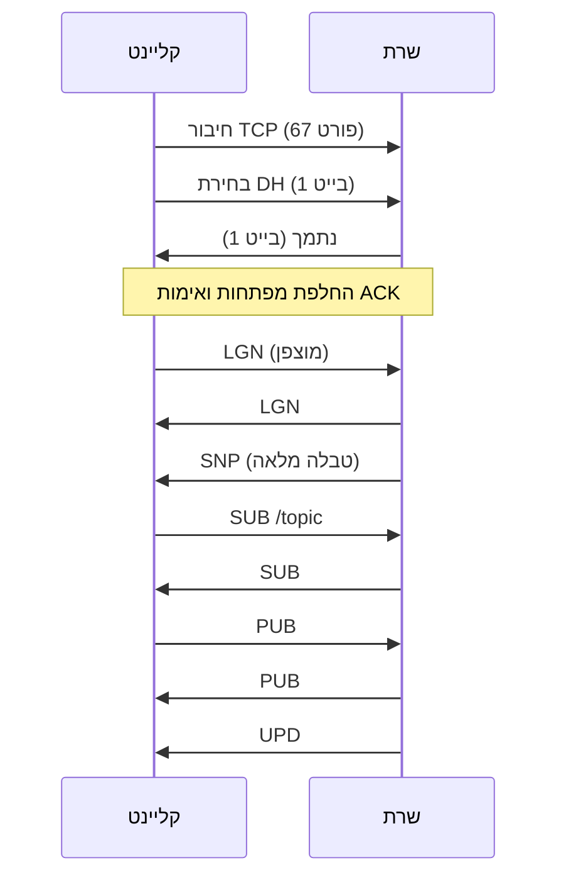

# SimpleNetworkTables — מפרט פרוטוקול תקשורת

**גרסה בעברית** · ראו גם: [`protocol.md`](protocol.md) (English)

מסמך זה מתאר את אופן התקשורת בין **השרת** (`host/Server.py`) ל**קליינט** (`client/src/backend.py`, `protocol/tcp_client.py`) בפרוטוקול TCP. SimpleNetworkTables הוא שיבוט לימודי בהשראת WPILib NetworkTables; הוא **אינו** תואם ברמת הבייטים ל-NetworkTables 4 הרשמי.

---

## 1. סקירה כללית

התקשורת בנויה בשכבות:

| שכבה | תיאור |
|------|--------|
| תעבורה | TCP (IPv4), פורט **67** |
| מסגור | הודעות עם כותרת אורך ("TCP by size") |
| החלפת מפתחות | RSA או Diffie-Hellman (בטקסט גלוי במהלך handshake) |
| יישום | הודעות מוצפנות AES-256-CBC עם קודי opcode באורך 3 תווים |

קבצי מימוש עיקריים:

| קובץ | תפקיד |
|------|--------|
| `protocol/tcp_socket.py` | מסגור, הצפנה ופענוח AES |
| `protocol/tcp_client.py` | handshake בצד הקליינט (RSA / DH) |
| `protocol/tcp_server.py` | `ClientSocketWrapper`, handshake בשרת |
| `protocol/protocol_constants.py` | קודי opcode (`ProtocolCode`), שגיאות (`ProtocolError`) |
| `protocol/NetworkTables.py` | עץ היררכי של topics |
| `protocol/Entry.py` | סוגי ערכים, מנויים, משלוח עדכונים |
| `host/Request.py` | המרת תוצאות handler להצלחה או לתגובת `ERR` |

---

## 2. שכבת התעבורה

- **פרוטוקול:** TCP בלבד (ללא HTTP, WebSocket או UDP).
- **שרת:** מאזין על `0.0.0.0:67` (`host/server_constants.py`).
- **קליינט:** מתחבר כברירת מחדל ל-`127.0.0.1:67` (`client/src/BackendConstants.py`).
- **הפעלות:** חיבור TCP מתמשך אחד לכל קליינט. השרת יוצר קבוצת threads ייעודית לכל socket שמתקבל.

---

## 3. מסגור הודעות (TCP by size)

לפני החלת ההצפנה, כל הודעה משתמשת באותו מסגור (`protocol/tcp_socket.py`):

```
┌──────────────────┬─────────────────────────────┐
│ כותרת 8 בייט     │  payload (בדיוק N בייטים)   │
│ (7 ספרות + '|')  │                             │
└──────────────────┴─────────────────────────────┘
```

- **כותרת:** שבע ספרות עשרוניות עם אפסים מובילים ואחריהן `|` (למשל `0000042|` עבור 42 בייטים).
- **פונקציות:** `raw_send_with_size` / `raw_recv_by_size` — מסגור בלבד.
- **פונקציות:** `send_with_size` / `recv_by_size` — מסגור והצפנת AES (לאחר handshake).

אם הצד המקבל לא קורא את כל ה-payload, המימוש מחזיר בייטים ריקים (`b""`), ויש לטפל בכך כבכשל חיבור.

---

## 4. הקמת הפעלה מאובטחת

הקליינט בוחר **RSA** או **Diffie-Hellman** דרך `EncryptionType` בממשק. השרת קורא את הבחירה ב-`ClientSocketWrapper.accept_secure()`.

### 4.1 משא ומתן על אלגוריתם

| כיוון | תוכן | משמעות |
|-------|------|--------|
| קליינט → שרת | בייט 1: `encryption_type.value` | `1` = RSA, `2` = DH |
| שרת → קליינט | בייט 1 | `1` = נתמך, `0` = נדחה |

### 4.2 handshake של RSA

כל השלבים משתמשים במסגור **raw** (ללא AES):

1. קליינט → שרת: `ACK` (מחרוזת `"ACK"`).
2. שרת → קליינט: מפתח RSA ציבורי (PEM).
3. קליינט → שרת: מפתח AES בן 32 בייט מוצפן ב-RSA-OAEP (SHA-256).
4. השרת מפענח ושומר `aes_key`.
5. שרת → קליינט: `ACK` מוצפן באמצעות `send_with_size`.
6. הקליינט מאמת `ACK` מפוענח → ההפעלה הוקמה.

הקליינט יוצר את מפתח ה-AES בעת יצירת `TcpClient` (`os.urandom(32)`).

### 4.3 handshake של Diffie-Hellman

1. קליינט → שרת: `ACK` (raw).
2. שרת → קליינט: פרמטרי DH מ-`host/DH.pem` (2048 ביט, נוצר אוטומטית אם חסר).
3. קליינט → שרת: מפתח ציבורי של הקליינט (PEM).
4. שרת → קליינט: מפתח ציבורי של השרת (PEM).
5. שני הצדדים מחשבים סוד משותף וגוזרים מפתח AES בן 32 בייט:

   `HKDF-SHA256(length=32, salt=None, info=b"ACK").derive(shared_secret)`

6. שרת → קליינט: `ACK` מוצפן.
7. קליינט → שרת: `ACK` מוצפן (שלב נוסף שאינו קיים במצב RSA).
8. הקליינט מאשר חיבור ב-`__verify_connection`.

לאחר ה-handshake, כל תעבורת היישום משתמשת ב-`send_with_size` / `recv_by_size`.

---

## 5. הצפנת AES

לאחר שהוגדר `aes_key` בשני הצדדים:

**שליחה:** ריפוד PKCS7 → IV אקראי של 16 בייט → AES-256-CBC → על החוט: `IV || ciphertext` (בתוך מסגרת האורך).

**קבלה:** תהליך הפוך.

חומר ה-handshake (מפתחות, נתוני PEM) משתמש רק בשכבת המסגור הגלויה (raw).

---

## 6. פורמט הודעות יישום

מטעני היישום הם מחרוזות UTF-8 (ללא JSON או protobuf):

```text
<CODE><FIELD_0><DELIMITER><FIELD_1><DELIMITER>...
```

| רכיב | כלל |
|------|------|
| `CODE` | בדיוק 3 תווי ASCII (`ProtocolCode`) |
| `DELIMITER` | 40 תווי גרב (`` ` ``) (`FIELD_DELIMETER`) |
| שדות | מחרוזות לפי ה-opcode |

**קליינט — בניית בקשה:**
```python
code + DELIM.join(args)
```

**פירוק (קליינט ושרת):**
```python
code = message[:3]
fields = message[3:].split(DELIMITER)
```

**מגבלה:** ערכי שדות אסורים להכיל את רצף המפריד, אחרת הפירוק ייכשל. מגבלה זו מתועדת בקוד המקור ואינה מטופלת בזמן ריצה.

---

## 7. ארכיטקטורת השרת

לכל קליינט מחובר רצים שלושה threads (`deal_with_async_client`):

| Thread | אחריות |
|--------|--------|
| `listen_to_client` | קבלת הודעות ב-`recv_by_size`, הוספה לתור |
| `business_logic` | ניתוב בקשות מהתור ל-handlers |
| `update_client` | שליחת הודעות `UPD` למנויים (מרווח polling ~20 ms) |

ה-handlers רשומים ב-`Server.business_logic_requests`.

`Request.respond` (`host/Request.py`):

1. מפעיל את callback של ה-handler.
2. אם דגל שגיאה כלשהו הוא `True`, שולח `ERR` עם ה-opcode שנכשל וקוד השגיאה.
3. אחרת שולח הצלחה: `build_response(original_opcode)` (לעיתים ללא שדות נוספים).

**הערה:** ה-handlers מקבלים `fields` עטוף ברשימה; ב-`Server.py` הרשימה האמיתית נגישה כ-`fields[0]`.

---

## 8. ארכיטקטורת הקליינט

פקודות הממשק קוראות לפונקציות כמו `AppBackend.login()` ש**שולחות** בקשות באופן אסינכרוני.

Thread רקע `_update()` ברציפות:

1. קורא ל-`recv_by_size()`.
2. מנתב הודעות `UPD` למילון המקומי `network_tables`.
3. שומר תשובות אחרות ב-`messages`; תשובות `ERR` גם ב-`errors`.

הפקודות עושות poll ל-`get_messages_of_type(ProtocolCode)` עד להגעת תשובה מתאימה. אין מזהי בקשה; ההתאמה היא לפי opcode בלבד.

---

## 9. פרוטוקול שגיאות

**Opcode:** `ERR`

**פורמט:**
```text
ERR<DELIMITER><failed_opcode><DELIMITER><error_code>
```

| קוד | שם | סיבה אופיינית |
|-----|-----|----------------|
| 0 | `INVALID_AUTH` | פרטי התחברות שגויים או חשבון לא מאומת |
| 1 | `WRONG_EMAIL` | אימייל לא נמצא |
| 2 | `USERNAME_TAKEN` | הרשמה |
| 3 | `EMAIL_TAKEN` | הרשמה |
| 4 | `WRONG_CODE` | קוד אימות שגוי |
| 5 | `CODE_EXPIRED` | מוגדר, בשימוש מועט |
| 6 | `USER_ALREADY_VALID` | שליחת קוד לחשבון שכבר אומת |
| 7 | `INVALID_TYPE` | סוג ערך לא תקין |
| 8 | `BAD_DATA` | נתונים פגומים |
| 9 | `ALREADY_SUBSCRIBED` | הרשמה כפולה לאותו topic |

נתוני חשבון נשמרים ב-`host/db.pkl`; מיילי אימות נשלחים דרך `host/send_email.py` (מחוץ לפרוטוקול על החוט).

---

## 10. קודי אימות (Authentication)

אלא אם צוין אחרת: **הקליינט** שולח `build_request`; **תשובת הצלחה מהשרת** היא אותן 3 אותיות ללא שדות.

### `LGN` — התחברות
- **בקשה:** `username`, `password`
- **הצלחה:** `LGN`; השרת שולח גם snapshot `SNP`
- **שגיאה:** `ERR` + `LGN` + `0` בכשל אימות

### `RGS` — הרשמה (שלב 1)
- **בקשה:** `username`, `password`, `email`
- **שגיאות:** `2` (שם תפוס), `3` (אימייל תפוס)

### `VRF` — אימות הרשמה
- **בקשה:** `username`, `password`, `code`
- **שגיאות:** `0` (סיסמה שגויה), `4` (קוד שגוי)

### `RSD` — שליחת קוד הרשמה מחדש
- **בקשה:** `username`
- **שגיאות:** `6` (כבר מאומת), `0` (משתמש לא תקין)

### `FRG` — שכחתי סיסמה
- **בקשה:** `email`
- **שגיאה:** `1` (אימייל לא נמצא)

### `VFR` — אימות קוד שחזור סיסמה
- **בקשה:** `email`, `code`
- **שגיאות:** `1`, `4`

### `RST` — איפוס סיסמה
- **בקשה:** `email`, `code`, `new_password`
- **שגיאות:** `1`, `4`

### `RSE` — שליחת מייל שחזור סיסמה מחדש
- **בקשה:** `email`
- **שגיאה:** `1`

`CRG` (`CONFIRM_REGISTER`) מוגדר בקבועים אך לא ממומש בשרת.

---

## 11. Network Tables (פרסום / מנוי)

נתיבי topics משתמשים בנתיבים מופרדים ב-slash (למשל `/robot/arm/angle`). השרת מחזיק עץ עם שורש `HEAD` (`protocol/NetworkTables.py`).

### `SUB` — הרשמה לעדכונים
- **בקשה:** נתיב topic
- **שגיאה:** `9` אם כבר רשומים
- מנויים מקבלים עדכונים על הצומת ועל צאצאיו.

### `PUB` — פרסום
- **בקשה:** `topic`, `type` (מספר כמחרוזת), `value` (ייצוג מחרוזת של bytes)
- השרת מעדכן את הרשומה ומסמן מנויים לעדכון.

### `UPD` — עדכון (שרת → קליינט בלבד)
```text
UPD<topic><type><value><topic><type><value>...
```
שלשות חוזרות לכל רשומה שהשתנתה. השרת עשוי לאגד מספר רשומות; הקליינט הנוכחי מפרק שלשה אחת לכל הודעת `UPD`.

### `SNP` — Snapshot (שרת → קליינט בלבד)
נשלח לאחר התחברות מוצלחת. אותו פורמט שלשות כמו ב-`UPD`, עם כל הרשומות בעץ. הקליינט אינו מטפל ב-`SNP` באופן ייעודי; לוח הבקרה מסתמך בעיקר על `SUB` ו-`UPD`.

---

## 12. סוגי ערכים

מ-`protocol/Entry.py`:

| סוג | ערך |
|-----|------|
| `PLACEHOLDER` | -1 |
| `BOOLEAN` | 0 |
| `INT_64` | 1 |
| `FLOAT_64` | 2 |
| `STRING` | 3 |
| `BYTES` | 4 |
| סוגי מערכים | 5, 6, 7 |

על החוט, `type` נשלח כ-`str(entry.type.value)`. ערכים נשלחים לעיתים כ-`str(bytes)`. הקליינט מפרש ערכי `UPD` עם `value[2:-1]` בעת עדכון.

**דוגמת פרסום מהקליינט:**
```python
build_request(PUBLISH, topic, str(entry_type.value), str(value_bytes))
```

---

## 13. טבלת קודי opcode

| Opcode | Enum | כיוון | תיאור |
|--------|------|-------|--------|
| `LGN` | LOGIN | דו-כיווני | אימות |
| `RGS` | REGISTER | דו-כיווני | התחלת הרשמה |
| `VRF` | VERIFY_REGISTER | דו-כיווני | אימות קוד אימייל |
| `RSD` | RESEND_CODE | דו-כיווני | שליחת קוד הרשמה מחדש |
| `FRG` | FORGOT_PASSWORD | דו-כיווני | התחלת שחזור סיסמה |
| `VFR` | VERIFY_FORGOT | דו-כיווני | אימות קוד שחזור |
| `RST` | RESET_PASSWORD | דו-כיווני | הגדרת סיסמה חדשה |
| `RSE` | RESEND_FORGOT_MAIL | דו-כיווני | שליחת מייל שחזור מחדש |
| `SUB` | SUBSCRIBE | דו-כיווני | הרשמה ל-topic |
| `PUB` | PUBLISH | דו-כיווני | פרסום ערך |
| `UPD` | UPDATE | שרת → קליינט | דחיפת עדכון |
| `SNP` | SNAPSHOT | שרת → קליינט | snapshot מלא של הטבלה |
| `ERR` | ERROR | שרת → קליינט | כשל בפעולה |
| `CRG` | CONFIRM_REGISTER | — | לא ממומש |

`ACK` משמש רק במהלך handshake הקריפטוגרפי, ולא כ-`ProtocolCode`.

---

## 14. זרימת הפעלה אופיינית



---

## 15. מגבלות ידועות

1. **מפריד:** שדות אסורים להכיל את רצף 40 הגרביים (`` ` ``).
2. **ללא מזהי בקשה:** בקשות מקבילות מאותו opcode עלולות להתאים לתשובה שגויה.
3. **RSA מול DH:** ב-DH נדרש `ACK` מוצפן נוסף מהקליינט; יש לעקוב בדיוק אחר `tcp_client.py` ו-`tcp_server.py`.
4. **טיפול ב-SNP:** השרת שולח snapshot לאחר התחברות; ממשק הקליינט מסתמך בעיקר על `SUB`/`UPD`.
5. **תאימות:** פרוטוקול זה ספציפי ל-SimpleNetworkTables ואינו תואם ל-WPILib NetworkTables 4 ללא שכבת תרגום.

---

*גרסת המסמך תואמת למימוש בפרויקט SimpleNetworkTables. יש לעדכן מסמך זה בעת שינוי הפרוטוקול.*
